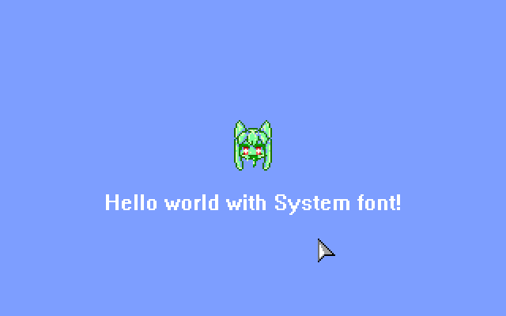

**How to use this demo:**

1. Copy Microsoft `.FNT` files into `FONTS` folder
2. Edit `GAME.PAS`
3. Scroll down to `OnPreload`
4. Change the font filename with the one that you want to use

The font must be in FNT format (Microsoft font resource),
**not** FON (Microsoft bitmap font collection)

