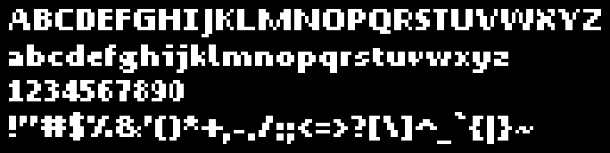

P92 Sans font data must be synchronised with the WASM version

The files in this folder is only serving as the source of truth within Posit-92 DOS

The order is like this:

- Posit-92 (WASM): source of truth
- Posit-92 (DOS): copy of above, with these key colours:
  - $0F: glyph
  - $0D: transparency key

The font in the DOS version is simply a copy, but with the format of an indexed bitmap




The filenames follow this pattern:

```text
P92SAN + size + weight
```

So it would be like this:

- P92SAN11
- P92SAN8R
- P92SAN8B