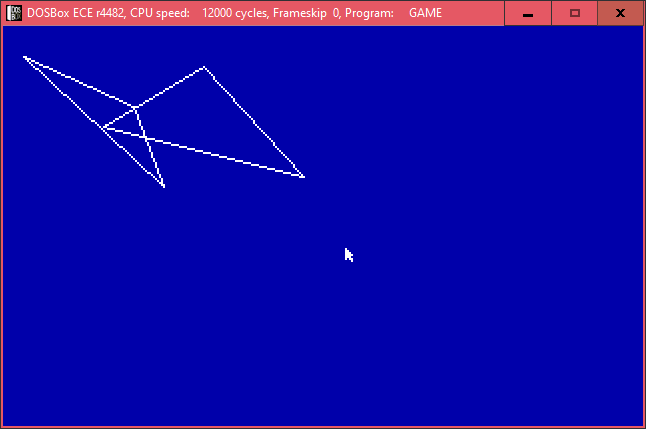
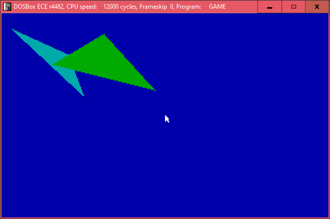

This file documents all of the available API's in this game framework

## Units

### Bitmap

`procedure loadBMP(var output: PBitmap; filename: string)`

Loads a BMP file.

The format has to be an indexed 256 colour BMP, which pallette you can get from either Aseprite or Photoshop


`procedure drawBMP(image: PBitmap)`

Blits a `PBitmap` ignoring any transparency.


`procedure freeBMP(var image: PBitmap)`

Frees a `PBitmap`, also assigns `image` to `nil`.


`procedure spr(image: PBitmap; x, y: integer; transparencyKey: byte)`

Blits a `PBitmap` with the transparency key.

The transparency key is one of the 256 colours supported by the VGA display.


`procedure bitmapInfo(image: PBitmap)`

Used for debugging -- prints out `PBitmap` information


### Conv

Common conversion utility unit

`function i32str(value: Longint): string`

Converts a 32-bit integer to string


`function f32str(value: double): string`

Converts a number to string with 4 decimals


### FPS

`procedure initFPSCounter`

Initialises the FPS counter variables.


`procedure incrementFPS`

This procedure is called within the `update` function to update both the last FPS time and the FPS counter itself.


`procedure drawFPS`

Renders the last recorded FPS count


### Graphics

Primitive drawing unit

`procedure circ(cx, cy, radius: integer; colour: byte)`

Draws a circle outline

`procedure circfill(cx, cy, radius: integer; colour: byte)`

Draws a filled circle

`procedure line(x1, y1, x2, y2: integer; colour: byte)`

Draws a line segment

`procedure rect(x0, y0, x1, y1: integer; colour: byte)`

Draws a rectangle outline

`procedure rectfill(x0, y0, x1, y1: integer; colour: byte)`

Draws a filled rectangle

`procedure tri(x0, y0, x1, y1, x2, y2: integer; colour: byte)`

Draws a triangle outline

Example:

```pascal
cls(1);
tri(10, 15, 80, 80, 65, 40, 15);
tri(50, 50, 100, 20, 150, 75, 15);
```



`procedure trifill(x0, y0, x1, y1, x2, y2: integer; colour: byte)`

Draws a filled triangle

Example:

Draw a dark cyan and a green filled rectangles:

```pascal
cls(1);
trifill(10, 15, 80, 80, 65, 40, 3);
trifill(50, 50, 100, 20, 150, 75, 2);
```




### Keyboard

`procedure initKeyHandler`

This initialises the non-blocking keyboard input handler


`procedure resetKeyHandler`

This must be called before exiting the game, otherwise it will crash DOS


`function isKeyDown(scancode: byte): boolean`

Checks if a key is currently pressed

You can refer to the scancodes from these lists:
- https://www.freepascal.org/docs-html/rtl/keyboard/kbdscancode.html
- https://www.freebasic.net/wiki/GfxScancodes


### Logger

`procedure initLogger`

This is required to start the Logger utility.


`procedure writeLog(const msg: string)`

Writes a line of message into the log file.


`procedure closeLogger`


### Mouse

#### Global Variables

`mouseX, mouseY: word`

`mouseButton: byte`

Contains either one of these values:
- 0: No mouse button is pressed
- 1: Left button is pressed
- 2: Right button is pressed
- 3: Both buttons

#### Procedures

`procedure initMouse`

Must be called first before using the mouse.


`procedure updateMouse`

Updates the mouse position & button by interrupts.


`procedure debugMouse`

Shows the mouse coordinates on screen and the buttons pressed.


`procedure drawMouse`

Draws the mouse cursor. You can change it in `loadCursor` in `MOUSE.PAS`.  The bitmap has to be an indexed bitmap that uses the VGA colour table.


`procedure resetMouse`

Must be called before returning to screen mode 00h, otherwise the mouse control will be stuck & Runtime error 20302 happens.


### Timing

#### Global Variables

`dt: double`

This is the delta time in seconds. The value must be updated in `updateDeltaTime`

#### Procedures & Functions

`function Timer: real`

Gets the timer in seconds since midnight, similar to QuickBASIC's `TIMER`

The precision is around 1 / 18th of a second


`function GetTimer: real`

Gets the timer in seconds since midnight. It's better to use this instead of `Timer` because the precision is better

Example:

Render delta time and getTimer

```pascal
print('Delta t: ' + f32str(dt), 0, 0, 7);
print('GetTimer: ' + f32str(getTimer), 0, 8, 7);
```


`function GetTimerMS: Longint`

Gets the timer in milliseconds since midnight. The implementation is similar to `GetTimer`


`procedure Limit(fps: integer)`

Limits the loop to a certain amount within a second. Similar to QB64's `_LIMIT`. This has to be used inside a loop.


`procedure initDeltaTime`

Initialises delta time values


`procedure updateDeltaTime`

Updates delta time and the internal timer diff


### VGA

This unit handles the screen mode switch, the double buffering and some rudimentary tasks


`procedure initVGAMode`

Sets the screen mode to mode 13h. This is required to use the 64K screen buffer features


`procedure initTextMode`

Sets the screen mode back to text mode


`procedure loadFont`

Copies 128 characters of the 8x8 font from BIOS ROM to be used later with `print`.

The capacity can be changed in `VGA.PAS` up to 256 like this:

```pascal
font8x8: array[0..255, 0..7] of byte;
```


`procedure cls(colour: byte)`

Fills the active screen buffer to a certain colour


`procedure print(text: string; x, y: integer; colour: byte)`

Requires `loadFont` call, otherwise it doesn't output anything to the active screen buffer


`procedure pset(x, y: word; colour: byte)`

Sets a pixel on screen to a certain colour. Similar to PICO-8's `PSET`


`procedure flush`

Copies the current buffer to the VGA RAM. Ideally called at the end of a drawing routine


`procedure initBuffer`

Initialises the 64KB graphics buffer


`procedure freeBuffer`

Frees the 64KB graphics buffer
