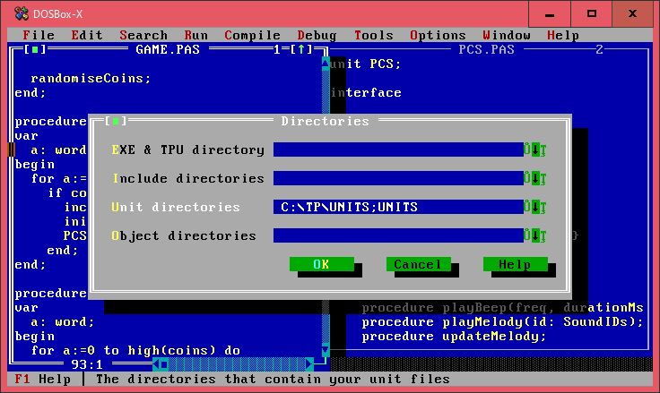
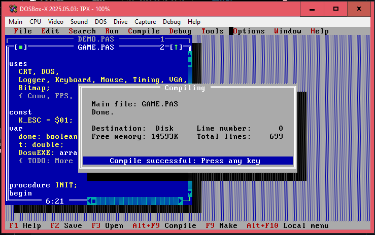

# Building

## Requirements

- **Turbo Pascal 7.0** is required to build the unit files and the executable
- **js-dos** is required for web export

## Building

1. Clone the git repository,
2. Start your DOSBox of choice, make sure that the CPU cycles setting is set to at least `10000` or `max`,
3. Start **Turbo Pascal** (`TPX.EXE`),
4. Change directory to the cloned repository (**File menu > Change Dir**),
5. Open either `DEMO.PAS` or `GAME.PAS` (this is automatically set as the primary file),
6. Add the `UNITS` directory (**Options > Directories...**) as shown below:
  
  
7. Press `F9` to `Make` the project.

When it's done, all the compiled unit files (`.TPU` files) and the EXE should be in the same directory as the primary file.

The IDE will show something like this when it's done:

