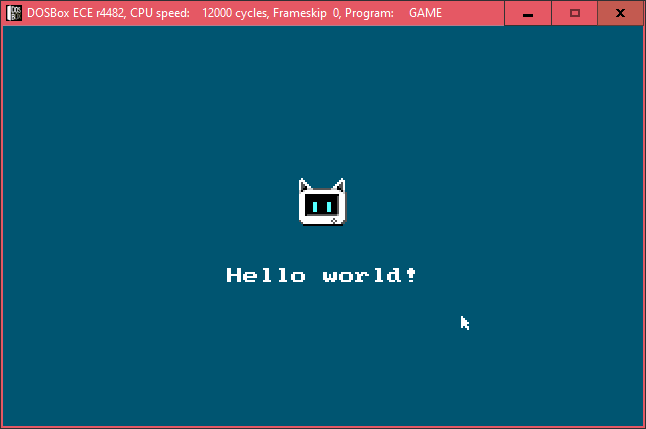
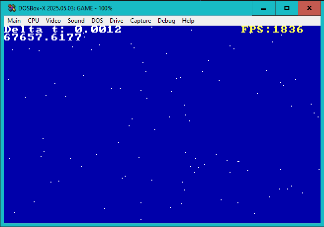

 **Posit-92**

A game framework for Turbo Pascal 7.0. The name comes from **Positron** and **1992** (the year in which TP7 was released), combined to resemble an isotope like Uranium-235 because it sounds cool  `:D`

My goal is to create something like a fantasy computer such as PICO-8 and TIC-80 but uses TP7 because I believe it's fast enough & easier than C.

I'm also inspired by [LoveDOS](https://github.com/rxi/lovedos) (also, the working fork with the audio working: https://github.com/SuperIlu/lovedos), and [TempleOS](http://www.templeos.org/)

Rainfall demo ([YouTube](https://www.youtube.com/watch?v=GJOnGodk5AU)):

More demos are inside `DEMOS` folder

## Getting started

1. `cd` to boilerplate,
2. Call `copy_units.ps1`,
3. Copy all the files inside the `boilerplate` directory (except for `copy_units.ps1`) to your DOS drive

Then, you can use `GAME.PAS` as the primary file

If you're using DOSBox or DOSBox-X, you can change the `cycles` setting to 32090 (emulating Pentium 60MHz), that's the setting that I usually use

When releasing a game made with this framework, I recommend you to change the `cycles` setting to `max`, and the `machine` to `vgaonly`

## Included units

### Primary units

- `GAME.PAS`: Program starting point

All the demonstrations are placed in `DEMOS`

### Utility units

- `ADLIB.PAS`: AdLib utility
- `BITMAP.PAS`: Utility for BMP files
- `BMFONT.PAS`: BMFont support utility
- `CONV.PAS`: Common conversion features
- `FPS.PAS`: FPS counter utility
- `GRAPHICS.PAS`: Primitives drawing utility
- `KEYBOARD.PAS`: Keyboard utility
- `LOGGER.PAS`: Debug logger utility
- `MATHS.PAS`: Math-related utility functions
- `MEMORY.PAS`: Memory debugging utility
- `MONOBMP.PAS`: 1-bit bitmap support utility
- `MOUSE.PAS`: Mouse utility
- `PANIC.PAS`: Panic halt utility
- `PCS.PAS`: PC speaker utility
- `STRINGS.PAS`: String operation utility
- `TIMING.PAS`: Time-related utility
- `VGA.PAS`: Utility for VGA access

If you want the scancodes for the keyboard, you can refer to these lists:
- https://www.freepascal.org/docs-html/rtl/keyboard/kbdscancode.html
- https://www.freebasic.net/wiki/GfxScancodes

#### Mode X units

All Mode X units are prefixed by an X to differentiate from Mode Y (mode 13h) operations

- `MODEX.PAS`: Base Mode X unit
- `XBITMAP.PAS`
- `XMOUSE.PAS`

Some units have Mode X implementation, which can be activated with the `{$DEFINE MODEX}` directive, such as `FPS.PAS`

