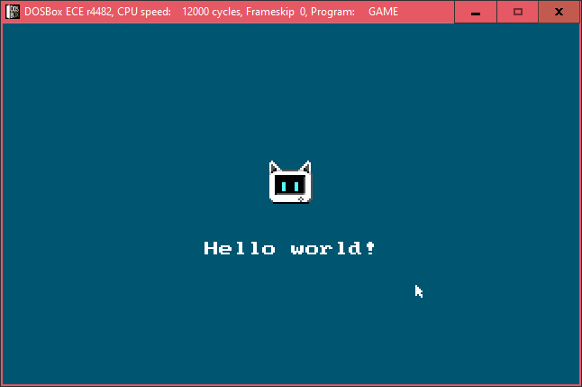
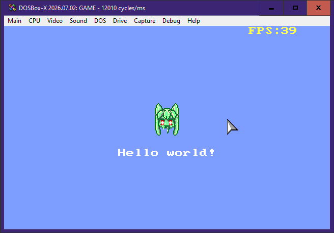
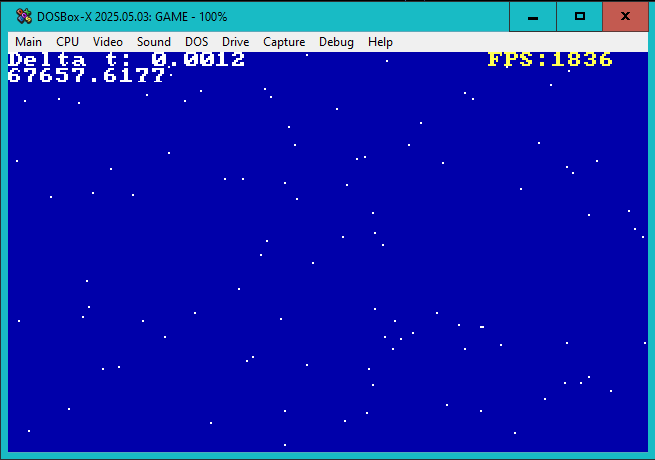

 **Posit-92**

_"Not retro for nostalgia. Retro for power."_

A handcrafted game framework for Turbo Pascal 7.0.  Inspired by the raw speed, minimalism and creativity of pre-2000 tools.

Rainfall demo ([YouTube](https://www.youtube.com/watch?v=GJOnGodk5AU)):

Games that I've made are available on my itch.io page:

https://hevanafa.itch.io/

## Requirements

- Turbo Pascal 7.0
- DOS or a DOS emulator such as DOSBox-X
- Perl (at least v5.38.2) for the dev helper scripts

## Getting started

(TODO)

## Recommended emulator settings

For general use, change the `cycles` to `12010`, which is the speed of a 486DX CPU

For test projects, set the `cycles` to `20000`

As for the memory size, make it at least 4 MB

## Project structure

- `DEMOS` - Example Posit-92 programmes
- `UNITS` - Posit-92 engine units
- `TESTS` - Test programmes

## Credits and Inspirations

The name comes from **Positron** and **1992** (the year in which TP7 was released), combined to resemble an isotope like Uranium-235 because it sounds cool  `:D`

My goal is to create something like a fantasy computer such as **PICO-8** and **TIC-80** but uses TP7 because I believe it's fast enough & easier than C, added with inline assembly, it's **even closer to metal**

I'm also inspired by:

- [LoveDOS](https://github.com/rxi/lovedos) (also, the working fork with the audio working: https://github.com/SuperIlu/lovedos), and
- [TempleOS](http://www.templeos.org/)
